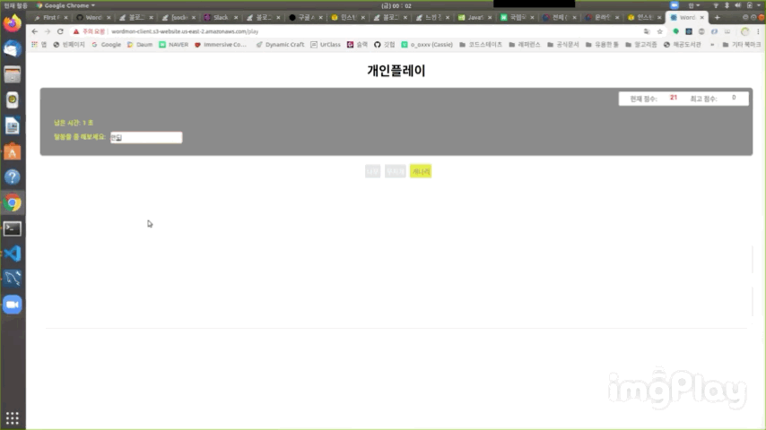
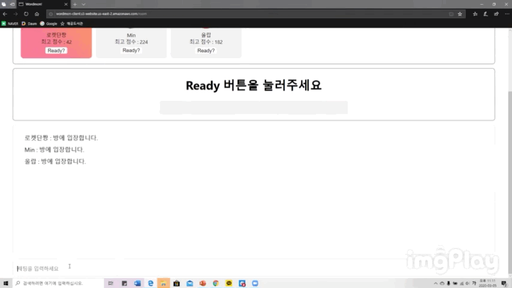
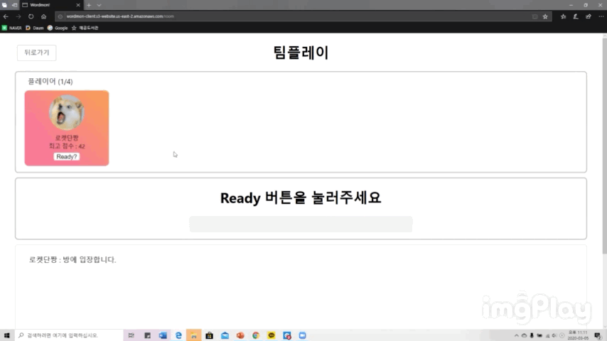
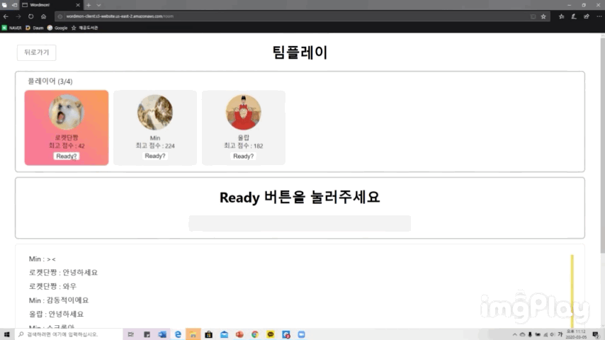

# Wordmon-client

웹 어플리케이션 워드몬은 심심함을 달래주고, 어휘력을 높여주며, 은근히 승부욕을 자극하는 끝말잇기 게임입니다.

## 주요 기능

1. 구글 소셜 로그인
   

2. 회원가입
   

3. 프로필사진 변경
   

4. 끝말잇기 - 개인전
   

5. 최고점수 관리
   

6. 채팅
   

7. 끝말잇기 - 단체전
   
   
   
   

## Tech Stack

- react (+ react-router-dom, react-google-login)
- redux (+ react-redux, redux-thunk)
- axios
- socket.io-client
- material-ui (/core, /icons, react-rainbowfy)

## Usage

1. 코드 복사
   `git clone https://github.com/codestates/Wordmon-server.git`

2. dev_local 브랜치로 이동
   `git checkout dev_local`

3. 패키지 설치
   `npm install`

4. 실행
   `npm start`

## 디렉토리 구조

```
├── src/
     └── components/
     |    ├──  Login/                      - login page component
     |    ├──  Login.css/                  - login page css
     |    ├──  Signup/                     - signup page component
     |    ├──  Mypage/                     - mypage page component
     |    ├──  Mypage.css/                 - mypage page css
     |    ├──  Play/                       - solo play page component
     |    ├──  Play/                       - solo play page css
     |    ├──  Room/                       - multiplay page component
     |    ├──  Room/                       - multiplay page css
     |    ├──  Usercard/                   - multiplay page 내 user info component
     |    ├──  Usercard/                   - multiplay page 내 user info css
     |    ├──  Chatbox/                    - multiplay page 내 user 채팅창 component
     |    └──  Chatbox/                    - multiplay page 내 채팅창 css
     ├── actions/
     |    ├── loginActions/                - login page에 필요한 함수들
     |    ├── signupActions/               - signup page에 필요한 함수들
     |    ├── myPageActions/               - mypage page에 필요한 함수들
     |    └── playActions/                 - play page에 필요한 함수들
     |
     ├── reducers/
     |    ├── loginReducer/                - login page의 state를 관리하는 reducer
     |    ├── signupReducer/               - signup page의 state를 관리하는 reducer
     |    ├── mypageReducer/               - mypage page의 state를 관리하는 reducer
     |    ├── playReducer/                 - play page의 state를 관리하는 reducer
     |    └── rootReducer/                 - 각 reducer들을 관리하는 root reducer
     |
     ├── App                              - 메인 자바스크립트
     ├── App.css
     └── index                            - 어플리케이션 엔트리 포인트
```
